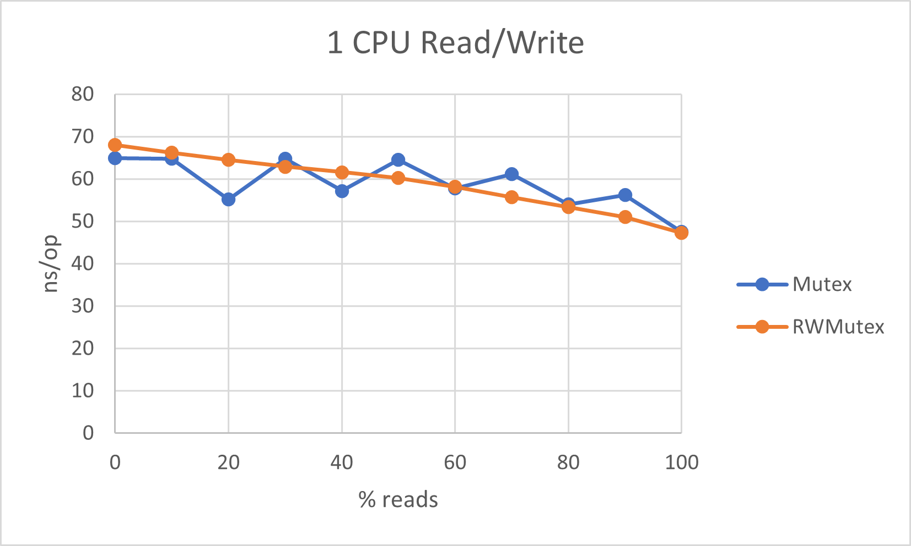
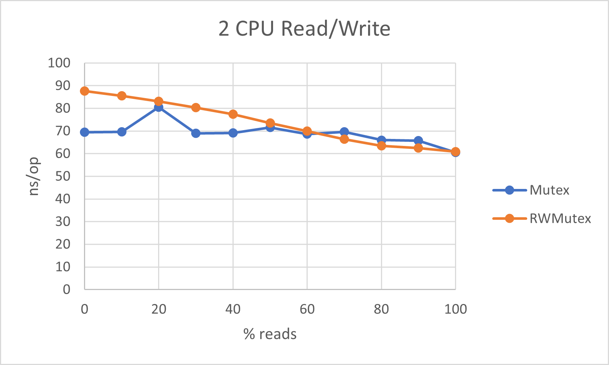
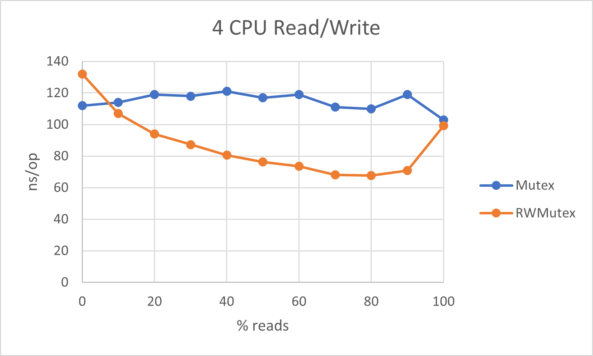
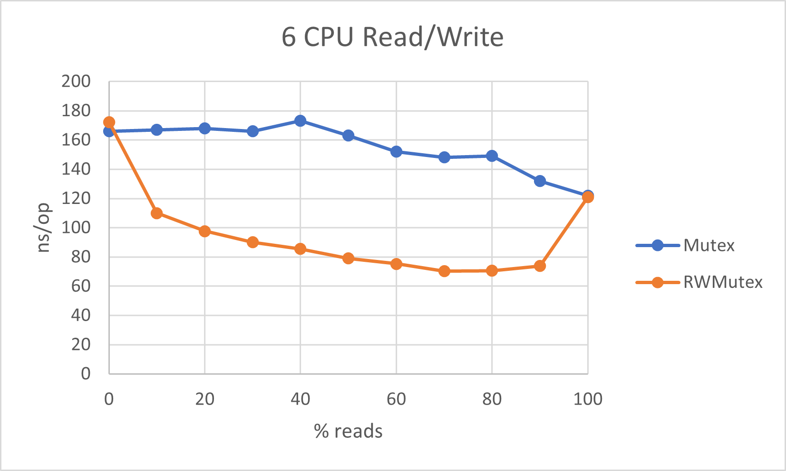
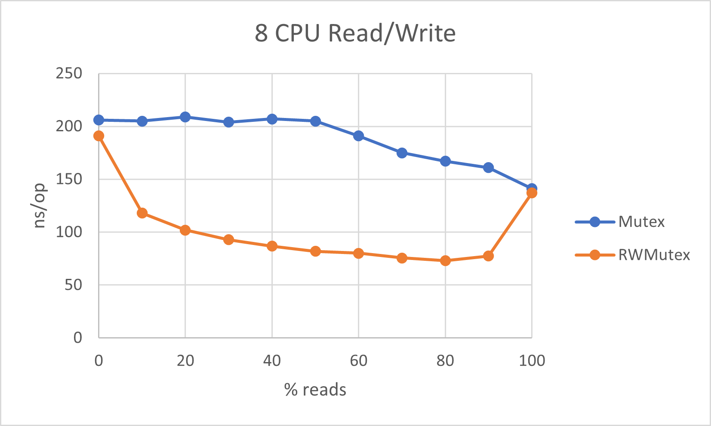

## Benchmarks

These benchmarks compare the performance of a cache protected by a `sync.Mutex` and a `sync.RWMutex`. An unprotected cache is not considered, as it cannot be safely written to, however it would be the fastest option for a read-only cache. The right choice of lock depends on the balance of read to write operations, and the number of processes used.

The benchmarks were run using different numbers of threads (using the `-cpu` flag with `go test`). For each number of threads, the speed of operations was checked for different ratios of read to write operations. These are from 0% reads to 100% reads in increments of 10%. The speed is measured in nanoseconds per operation (lower is faster).

The tests producing these results were run on an AWS EC2 m5.2xlarge instance, which has 8 vCPUs.

### 1 Thread

There is not much difference here, but the performance of `Mutex` seems more variable than `RWMutex`. Nothing is running in parallel so the difference will be down to the overhead of the lock and the difference in the underlying operations (reading is slightly faster).

### 2 Threads

We can see here that `RWMutex` is slightly faster when there is a high ratio of read to write operations.

### 4 Threads

There is quite a big change here. The `RWMutex` is clearly faster at 10% to 90% reads. It's not clear why the speed is the same for 100% reads; I expected the `RWMutex` to perform best in this situation.

### 6 Threads

The pattern continues here, but the difference is more pronounced.

### 8 Threads

We still see the same pattern here. The `Mutex` is slower still but the `RWMutex` maintains about the same speed at 10% to 90% reads.

### Conclusion

When running on 4 or more threads, the `RWMutex` is the clear winner, unless the traffic is overwhelmingly write-heavy. When running on fewer than 4 threads, the `Mutex` may perform better when the operations are mostly writes. Strangely the `RWMutex` seems to match the speed of the `Mutex` on 100% read operations; this should be investigated further.
